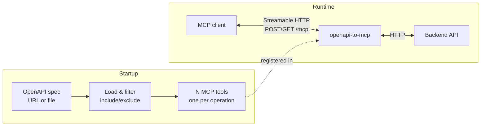

# OpenAPI to MCP

Standalone proxy that turns any **OpenAPI/Swagger**-described HTTP API into an **MCP (Model Context Protocol)** server. It loads the spec at startup, filters operations by include/exclude, and registers one MCP tool per API operation. Tool calls are executed as HTTP requests to the backend API.

Useful when you already have (or want) a REST API with an OpenAPI/Swagger spec: the same spec drives both human-readable API docs and MCP tools for AI clients.

## How it works



1. **Load OpenAPI spec** from `MCP_OPENAPI_SPEC_URL` (preferred) or `MCP_OPENAPI_SPEC_FILE`.
2. **Collect operations** (method + path). Filter: if `MCP_INCLUDE_ENDPOINTS` is set, keep only those; otherwise drop any in `MCP_EXCLUDE_ENDPOINTS`. Include has priority over exclude.
3. **For each operation** create an MCP tool: name = `MCP_TOOL_PREFIX` + path segment (e.g. `api_` + `messages` = `api_messages`), input schema from parameters and requestBody (Zod), handler = HTTP call to `MCP_API_BASE_URL`.

Transport: **Streamable HTTP**. Endpoint: **POST /mcp** and **GET /mcp**.

## Environment variables (MCP_ prefix)

| Variable | Description | Default |
|----------|-------------|---------|
| `MCP_API_BASE_URL` | Base URL for API requests | `http://127.0.0.1:3000` |
| `MCP_OPENAPI_SPEC_URL` | URL of OpenAPI spec (e.g. `http://api:3000/openapi.json`). Takes precedence over file. | - |
| `MCP_OPENAPI_SPEC_FILE` | Path to OpenAPI JSON file (used if URL not set) | - |
| `MCP_INCLUDE_ENDPOINTS` | Comma-separated `method:path` (e.g. `get:/messages,get:/channels`). If set, only these become tools. | - |
| `MCP_EXCLUDE_ENDPOINTS` | Comma-separated `method:path` to exclude. Ignored for endpoints in include. | - |
| `MCP_TOOL_PREFIX` | Prefix for tool names (e.g. `api_` -> `api_messages`, `api_channels`) | (empty) |
| `MCP_SERVER_NAME` | Server name reported to MCP clients | `openapi-to-mcp` |
| `MCP_PORT` | Port for Streamable HTTP server | `3100` |
| `MCP_HOST` | Bind host | `0.0.0.0` |

At least one of `MCP_OPENAPI_SPEC_URL` or `MCP_OPENAPI_SPEC_FILE` must be set.

## Run with npm (local)

1. Copy `.env.example` to `.env` and set at least the OpenAPI spec source and API base URL:

   ```bash
   cp .env.example .env
   # Edit .env: MCP_OPENAPI_SPEC_URL or MCP_OPENAPI_SPEC_FILE, MCP_API_BASE_URL
   ```

2. Install, build, and start:

   ```bash
   npm ci
   npm run build
   npm run start
   ```

3. The server listens on `http://<MCP_HOST>:<MCP_PORT>` (default `http://0.0.0.0:3100`). Connect MCP clients to **POST/GET** `http://localhost:3100/mcp` (Streamable HTTP).

Ensure the backend API is reachable at `MCP_API_BASE_URL` and that the OpenAPI spec URL (or file) returns a valid OpenAPI 3.x JSON.

## Run with Docker

Image on Docker Hub: [evilfreelancer/openapi-to-mcp](https://hub.docker.com/r/evilfreelancer/openapi-to-mcp). Use tag `latest` or a version tag (e.g. `v1.0.0`).

1. Pull and run with env vars (example: spec from URL, API at host):

   ```bash
   docker run --rm -p 3100:3100 \
     -e MCP_OPENAPI_SPEC_URL=http://host.docker.internal:3000/openapi.json \
     -e MCP_API_BASE_URL=http://host.docker.internal:3000 \
     evilfreelancer/openapi-to-mcp:latest
   ```

   On Linux you may need `--add-host=host.docker.internal:host-gateway` or use the host network. Alternatively pass a file path and mount the spec:

   ```bash
   docker run --rm -p 3100:3100 \
     -v $(pwd)/openapi.json:/app/openapi.json:ro \
     -e MCP_OPENAPI_SPEC_FILE=/app/openapi.json \
     -e MCP_API_BASE_URL=http://host.docker.internal:3000 \
     evilfreelancer/openapi-to-mcp:latest
   ```

   To build the image locally instead: `docker build -t openapi-to-mcp .` and use `openapi-to-mcp` as the image name in the commands above.

## Run with Docker Compose

A minimal `docker-compose.yaml` is included so you can run the MCP server and optionally point it at an existing API. It uses the image from Docker Hub ([evilfreelancer/openapi-to-mcp](https://hub.docker.com/r/evilfreelancer/openapi-to-mcp)).

1. Copy `.env.example` to `.env` and set:

   - `MCP_OPENAPI_SPEC_URL` (e.g. your API’s `/openapi.json` URL)
   - `MCP_API_BASE_URL` (e.g. `http://api:3000` if the API runs in another container)

2. From the project root:

   ```bash
   docker compose up -d
   ```

3. The MCP server will be available at `http://localhost:3100/mcp` (Streamable HTTP).

To use a local OpenAPI file instead of a URL, set `MCP_OPENAPI_SPEC_FILE` and mount the file into the container (see `docker-compose.yaml` comments if present).

## Tests

```bash
npm test
```

Tests cover: config (env vars, include/exclude, defaults), OpenAPI loader (URL and file, URL over file, error when both unset), and openapi-to-tools (filtering, prefix, handler calling API with success and error). HTTP is mocked (axios-mock-adapter).

## Dockerfile

The project includes a **Dockerfile** (Node 20 Alpine): install deps, build TypeScript, production prune, run `node dist/index.js`. No dev dependencies or tests in the image. Pre-built images are published to [Docker Hub](https://hub.docker.com/r/evilfreelancer/openapi-to-mcp). To build locally:

```bash
docker build -t openapi-to-mcp .
```

## CI - Docker image on Docker Hub

A GitHub Actions workflow (`.github/workflows/docker-publish.yml`) runs tests, then builds the image and pushes it to Docker Hub.

- **Triggers**: manually (Actions → "Docker build and push" → Run workflow) or on push of any git tag.
- **Version**: on tag push the image tag equals the git tag (e.g. `v1.0.0`); on manual run you can set a version (default `latest`).
- **Main only**: when triggered by a tag, the workflow checks that the tag points to a commit on `main`; otherwise the run fails.

**Required repository secrets** (Settings → Secrets and variables → Actions):

| Secret | Description |
|--------|-------------|
| `DOCKERHUB_USERNAME` | Docker Hub username (image will be `DOCKERHUB_USERNAME/openapi-to-mcp`) |
| `DOCKERHUB_TOKEN` | Docker Hub access token (recommended) or password |

## Similar projects

- **[mcp-openapi-proxy](https://github.com/matthewhand/mcp-openapi-proxy)** (Python) – MCP server that exposes REST APIs from OpenAPI specs as MCP tools. Low-level mode (one tool per endpoint) or FastMCP mode. Auth and endpoint filtering. Install: `uvx mcp-openapi-proxy`.
- **[openapi-mcp-proxy](https://github.com/JacerOmri/openapi-mcp-proxy)** (TypeScript) – CLI that turns an OpenAPI service into an MCP server; middleware between OpenAPI and MCP clients.
- **[openapi-mcp-generator](https://github.com/harsha-iiiv/openapi-mcp-generator)** (TypeScript) – Generates a full MCP server project from OpenAPI 3.0+ (stdio, SSE, Streamable HTTP), with Zod validation and auth. Install: `npm install -g openapi-mcp-generator`.
- **[FastMCP + OpenAPI](https://gofastmcp.com/integrations/openapi)** (Python) – OpenAPI integration for FastMCP: auth, route mapping, parameter handling.
- **[openapi-mcp-codegen](https://github.com/cnoe-io/openapi-mcp-codegen)** – Code generator from OpenAPI to MCP server (Apache 2.0).
- **[Swagger MCP](https://mcpmarket.com/server/swagger-4)** (Vizioz) – AI-driven MCP server generation from Swagger/OpenAPI; stores specs locally.
- **[liblab](https://liblab.com/docs/mcp/howto-generate-mcp-with-liblab)** – Cloud service: generate and deploy MCP server from OpenAPI or Postman collection.
